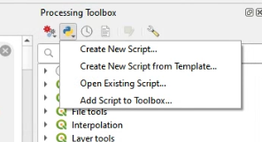
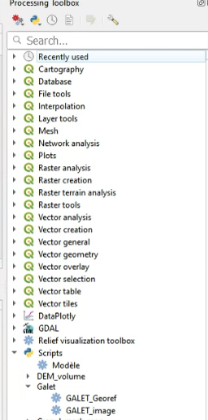

# Galet
Official repository of [GALET : A Deep Learning Image Segmentation Model for Drone-Based Grain Size Analysis of Gravel Bars](https://www.researchgate.net/publication/362231914_GALET_A_deep_learning_image_segmentation_model_for_drone-based_grain_size_analysis_of_gravel_bars)

**This release is licensed for research, academic and educational purpose only. If you intend to make commercial use of GALET, please contact us.**

The repository is based upon the implementation of  [Mask R CNN from Matterport](https://github.com/matterport/Mask_RCNN), modified to run on tensorflow 2.X.

Our approach is a local Server-Client Implementation. The user starts a Server (Mask-R-CNN) designed to handle all of the image processing, while QGis is considered as a Client, and is used as both a GUI and the tool for exploiting segmentation results. This approach was driven by the difficulty of having QGis and TensorFlow working together properly into an unique Conda space. Please note that this is a localhost Client/Server approach. None of the data shared between environments is sent on Internet.


## Preparing the installation

1 - Clone this repository

2 - Download the pretrained weight [here](https://drive.google.com/file/d/18kRFTrrsK91y44fTgpr7q9e4fMKIAroQ/view?usp=sharing) and put them into the folder GALET_RCNN_V3/weights/
(you need to create the _weights_ folder)

## Mask-R-CNN Server installation

This installation procedure is based upon Conda.

1 - From an Anaconda Prompt, Create a python 3.8 or 3.9 conda environment and activate it
```bash
conda create -n galet_server python=3.9
conda activate galet_server
```
**You need every of the following steps to be performed under the newly created *galet_server* conda environment**

2 - _skip this section if you don't want to, or can't run GALET on GPU_

Ensure that you have CUDA properly installed and setup by running
```bash
nvidia-smi
```
if this command is not recognized, run the CUDA installation again and/or set the CUDA_PATH variable in your environment. Use Google for further instructions. If you modify any environment value, including PATH or CUDA_PATH, you need to launch the Anaconda Prompt again so that changes are taken into account. Don't forget to activate the galet server environment again if you ever happen to do so.

Link your conda environment to CUDA. Versions used below are the last ones that allow native Windows GPU usage on Tensorflow.
```bash
conda install -c conda-forge cudatoolkit=11.2 cudnn=8.1.0
```

3 - From the root folder of the Galet project, install the server libraries
```bash
pip install -r requirements-server.txt
```

4 - From the root folder of the project, launch the server to verify that everything works as expected
```bash
python Galet_Server.py
```
Leave this window open as long as you need to use the Mask-R-CNN network. You can shut down the server by hitting Ctrl+C. Don't forget that every time you want to start the server, you need to activate the galet server conda environment:
```bash
conda activate galet_server
python Galet_Server.py
```


## QGis Client Installation

### With Conda

1 - From a new Anaconda Prompt, create a conda environment (any Python version>=3.8 is suitable)
```bash
conda create -n galet_qgis
conda activate galet_qgis
```
**You need every following step to be performed under the newly created *galet_qgis* conda environment**

2 - Install qgis and the required client libraries by running
```bash
conda install -c conda-forge qgis Pillow rasterio shapely opencv rtree
```

3 - Launch QGis
```bash
qgis
```

### With OsGeo

1 - Install Qgis with the official OsGeo Installer

2 - Run The OSGeo4WShell and run
```bash
pip install Pillow rasterio shapely opencv rtree
```

3 - Launch QGis


## How to use
1 - Within the server environment, launch the Mask-R-CNN server (4th step in the server installation section)

2 - Within the client environment, launch QGis (3rd step in the QGis client installation section)

3 - Once in qgis, open the processing tool box and add both scripts to the toolbox `Qgis_processing_IMAGE.py` and `Qgis_processing_ORTHO.py`.

They will appear under Galet




4 - Run GALET_georef for georeferenced orthomosaics, or GALET_image for ungeoreferenced images



